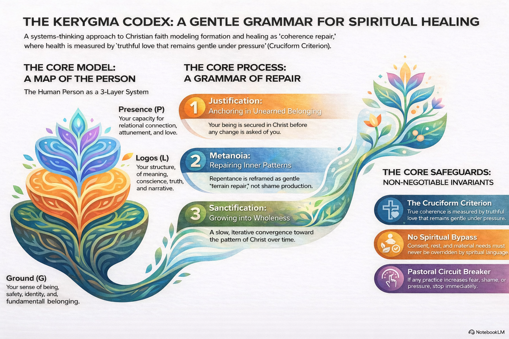

# The Kerygma Codex  
*A gentle grammar for spiritual healing and coherence repair*

> A gentle, trauma-aware Christian grammar for spiritual healing, formation, and coherence repair.

**The Kerygma Codex** is a public commons of prayerful language, practices, and safeguards for those seeking a faith that heals rather than harms.

It is not a new doctrine, denomination, or control system.  
It is offered as a *servant grammar* — a shared language for naming, repairing, and cultivating healthy spiritual life.

If your nervous system has been strained by religious pressure, spiritual performance, or coercive certainty, you are especially welcome here.

---

## The Codex at a Glance

> **Infographic:** a visual map of the Codex’s core structure and flow.

---

## Welcome

Many people who seek God find themselves navigating theological frameworks that, however well-intentioned, can create deep spiritual fragmentation. The language of faith, meant to be a source of life, can sometimes become a source of shame, pressure, and constant performance anxiety.

The Kerygma Codex was created as a response to this pain. It offers a gentle, trauma-aware Christian grammar — a compassionate framework for understanding spiritual formation and healing. It is not a new doctrine or a rulebook, but is offered as a shared language for repair for those longing for a faith that is both trustworthy and safe.

The central vision of the Codex is to cultivate a **repair ecology**, a habitat where healing becomes natural. It imagines faith less like a performance system and more like a *garden of chapels*: a place of rest, consent, and careful discernment where healing becomes natural.

---

## How to Begin

You do not need to read everything to begin.

A simple way in:

1. Read `INTRODUCTION.md`  
2. Explore one term in `/01_TERMS/`  
3. Try one practice in `/07_FUNDAMENTAL_PRACTICES/`

Return slowly. This is not a system to complete, it is a garden to walk in.

---

## Covenant of Posture

All use, teaching, adaptation, or extension of the Codex must honour:

• Consent  
• Gentleness  
• Trauma-awareness  
• Non-coercion  
• Safeguarding  
• **The Cruciform Criterion**, truthful love that remains gentle under pressure  

If any use increases fear, shame, urgency, domination, or control — it is out of bounds, in accordance with `ETHICAL_USE_ADDENDUM.md`.

---

## Who This Is Not For

This project will frustrate those seeking:

• Proof-text weapons  
• Totalising theological systems  
• Political or ecclesial domination tools  
• Quick-fix spiritual productivity frameworks  

It is for those willing to walk slowly, gently, and truthfully.

---

## Structure of the Codex

The Codex is structured as a living grammar of spiritual repair:

- `00_CONSTITUTION.md` — Core theological posture and safeguarding boundaries  
- `01_TERMS/` — Canonical grammar of spiritual life  
- `02_FORMALISM.md` — Systems-theological formalisation  
- `03_GLOSSARY.md` — Shared language definitions  
- `04_PASTORAL_GUARDRAILS.md` — Safeguards against harm  
- `05_CORE_OPERATORS.md` — Structural transformation patterns  
- `06_TESTS_AND_INVARIANTS.md` — Stability and coherence checks  
- `07_FUNDAMENTAL_PRACTICES/` — Healing participation practices  

Each layer exists to protect gentleness, consent, and truthfulness under pressure.

---

## A Living Commons

The Codex is stewarded as a commons of healing.  
Contributions are welcomed, but always subject to the Guardrails, Tests, and Covenant of Posture.

This is a protected garden, not an open battlefield.

See `CONTRIBUTING.md` for getting started!

---

*May this grammar serve healing, not harm.  
May it widen mercy, not narrow belonging.  
May it remain gentle, even when truth must be strong.*